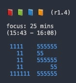
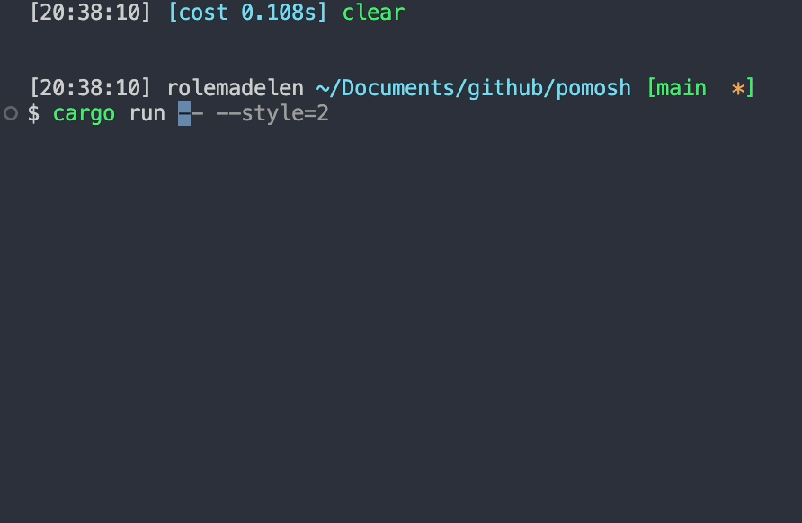
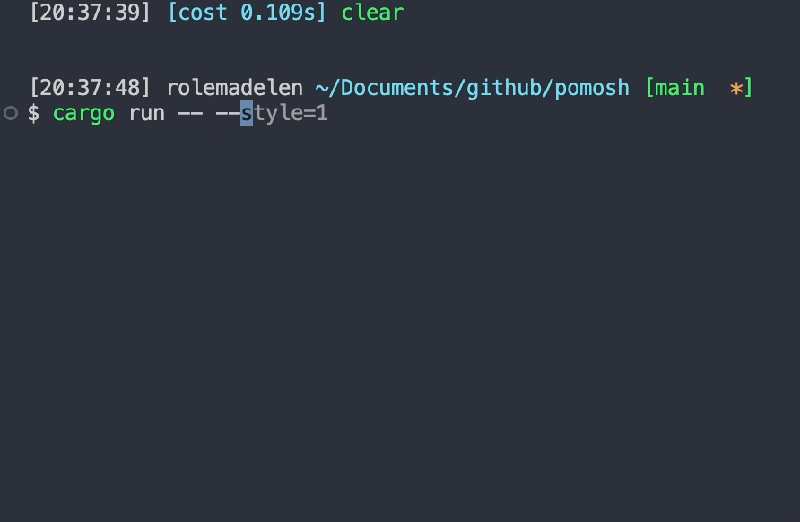

<div align="center">
    <h1>pomosh</h1>
    <b>Command-line Pomodoro Timer written in Rust</b>
    <div>
    	<a href="LICENSE.md"></a>
    	<a href="#"></a>
    </div>
</div>

<br />
<br />

Pomosh is a command-line pomodoro timer written in `Rust` that (supposedly) help you focus on your task. If you didn't know already, the name _pomosh_ is a mixture of these two terms: _pomodoro_ and _shell_.

<div align="center">


</div>

## Pomodoro technique?

Here are the basic steps of the pomodoro technique:
1. Decide the task to focus on.
2. Set the timer (typically 25 minutes).
3. Work on the task.
4. Take a short break when the timer goes off (typically 5-10 minutes).
5. Repeat steps 2 to 4.
6. After _four_ pomodoro sessions, take a long break (typically 20-30 minutes). After the long break, you can choose a new task to work on or continue with the same task and repeat from step 2.

Typical pomodoro intervals are 25/5 (25 minutes on, 5 minutes off), and 50/10.

## Installation

### Build from source

First, install `rustup` to get the `rust` compiler using `curl https://sh.rustup.rs -sSf | sh -s`. Then, 

```sh
$ git clone https://github.comrolemadelen/pomosh
$ cd pomosh
$ cargo build --release

$ ./target/release/pomosh
```

### Homebrew

```shell
$ brew tap rolemadelen/pomosh
$ brew install pomosh
```

To update, run 

```sh
$ brew update
$ brew upgrade pomosh
```

## Usage 

```text
Usage: pomosh [OPTIONS]

Options:
  -p, --preset <1|2>  Preset pomodoro (focus/break/long break): 1) 25/5/10, 2) 50/10/20
  -s, --style <1|2>   Configure timer text font
                       1) Univers (*default)
                       2) Yuanqing
  -m, --mute          Disable session/break complete chime
  -h, --help          Print help
  -V, --version       Print version
```

You can run the command `pomosh` to configure the focus, short break, and long break durations.

```text
Focus duration (5-90 minutes): 50
Short break duration (5-90 minutes): 10
Long break duration (5-90 minutes): 20
```

Before your session starts, you can double check your configuration. 

```text
Focus duration: 60 mins
Break duration: 10 mins
Long Break duration: 20 mins
Chime: enabled
Start the session? (y/N): Y
```

### Preset

`pomosh` comes with two preset configurations (Focus duration / Short break / Long break):
1. 25/5/10
2. 50/10/20

If you want to run one of the presets, use `--preset=<OPTION>`.

```sh
$ pomosh --preset=1 # runs 25/5/10
$ pomosh --preset=2 # runs 50/10/20
```

### Style 

You can use `--style=<1|2>` flag to configure different text styles for the timer.

#### Univers

```sh
$ pomosh # default style

$ pomosh --style=1 # same as above
```



#### Yuanqing

```sh
$ pomosh --style=2
```



### Chime

The chime is **enabled by default**. If you want to disable it, pass `--mute` option.

```sh
$ pomosh --mute

$ pomosh --preset=1 --mute # runs the 25/5/10 preset with no chime
```

---

When the session begins, you'll see these notations at the top:

```text
📕 ◻ ◻ ◻  (r1.1)
```

- 📕 -> current pomodoro session
- ◻ -> session not started
- ◼ -> on short break
- (r1.1) -> round 1 pomodoro 1

So on the 4th session, the notations will look like the below:

```text
📕 📗 📘 📙  (r1.4)
```

Each book represents the pomodoro session.
