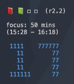

<div align="center">
    <h1>pomosh</h1>
    <b>Command-line Pomodoro Timer written in Rust</b>
    <div>
    	<a href="LICENSE.md"></a>
    	<a href="#"></a>
    </div>
</div>

<br />
<br />

Pomosh is a command-line pomodoro timer written in `Rust` that (supposedly) help you focus on your task. If you didn't know already, the name _pomosh_ is a mixture of these two terms: _pomodoro_ and _shell_.

<div align="center">


</div>

## Pomodoro technique?

Here are the basic steps of the pomodoro technique:
1. Decide the task to focus on.
2. Set the timer (typically 25 minutes).
3. Work on the task.
4. Take a short break when the timer goes off (typically 5-10 minutes).
5. Repeat steps 2 to 4.
6. After _four_ pomodoro sessions, take a long break (typically 20-30 minutes). After the long break, you can choose a new task to work on or continue with the same task and repeat from step 2.

Typical pomodoro intervals are 25/5 (25 minutes on, 5 minutes off), and 50/10.

## Installation

### Build from source

First, install `rustup` to get the `rust` compiler using `curl https://sh.rustup.rs -sSf | sh -s`. Then, 

```sh
$ git clone https://github.comrolemadelen/pomosh
$ cd pomosh
$ cargo build --release

$ ./target/release/pomosh
```

### Homebrew

```shell
$ brew tap rolemadelen/pomosh
$ brew install pomosh
```

## Guide 

You can set the focus, short-break, and the long-break durations all in minutes. You can also enable or disable the chime when the session/break completes.

```text
Focus duration (5-90 minutes): 50
Short break duration (5-90 minutes): 10
Long break duration (5-90 minutes): 20
Enable the 'session complete' chime? (y/N): y
```

Before your session starts, you can double check your configuration. 

```text
Focus duration: 50 mins
Break duration: 10 mins
Long Break duration: 20 mins
Chime: disabled
Start the session? (y/N): N
```

---

When the session begins, you'll see these notations at the top:

```text
📕 ◻ ◻ ◻  (r1.1)
```

- 📕 -> current session
- ◻ -> session not started
- ◼ -> on short break
- (r1.1) -> round 1 session 1

So on the 4th session, the notations will look like the below:

```text
📕 📗 📘 📙  (r1.4)
```

Each book represents the session.